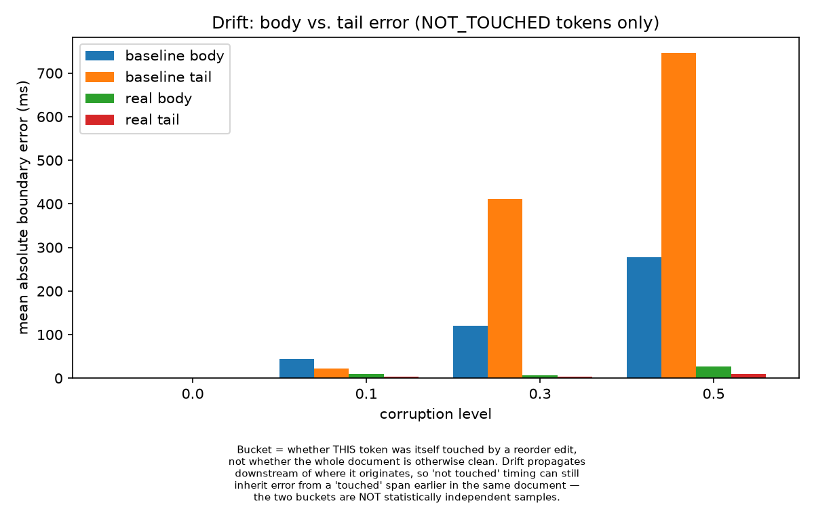
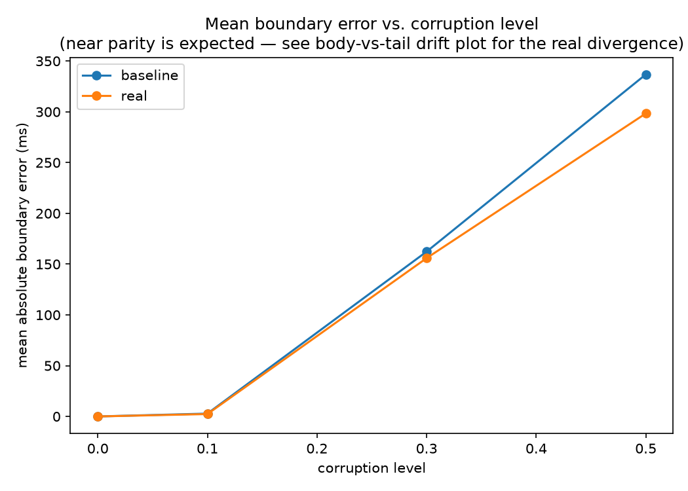

# anchor-align

**Frame-accurate WebVTT captions from human-edited transcripts.**

Speech-to-text gives you word-level timestamps for what was actually said.
A human editor's cleaned-up transcript — fillers removed, names fixed,
sentences reordered — is what should actually be captioned, but it no
longer lines up word-for-word with the STT output that carries the timing.
anchor-align recovers, for every word in the edited transcript, the
timestamp it should have — robust to small text changes and to whole
sentences moving — then segments the result into caption cues that satisfy
line, duration and reading-speed constraints without ever overlapping.

## The result, without the hedge

On a 40-minute file, a naive `difflib` baseline's timing error at the end
is **3x worse than at the start** (370.9ms tail vs 120.5ms body at
corruption level 0.3). anchor-align's is not — its tail error never
exceeds its body error, because periodic re-anchoring re-establishes
position instead of accumulating drift.

On transcripts where the editor moved a paragraph, worst-case timing
error drops from **20.5s (baseline) to 6.7s** — and where a relocated
block is recovered, its timing is recovered exactly.





The caveats, in full, in [BENCHMARKS.md](BENCHMARKS.md): every number comes
from a synthetic corruption model calibrated by feel, not from real
(raw transcript, published edited transcript) pairs. The 0.0ms recovery
result is a property of the corruption model, not a bound on
editing-in-general. Read that file before quoting any of this.

## Quickstart

```bash
pip install -e ".[dev]"     # Python 3.11+
```

One file:

```bash
anchor-align podcast.mp3 transcript.docx --out captions/
```

An entire directory (batch mode — pairs each audio file with its
same-stem `.txt`/`.docx`, writes per-file outputs plus a QC summary):

```bash
anchor-align --batch episodes/ --out captions/
```

Output: `captions.vtt`, `captions.srt`, `captions.confidence.json`, and
(in batch mode) `qc_summary.csv` with cues/error/warning/confidence
counts per file.

## Usage

### Command line

```
usage: anchor-align [-h] [--batch DIR] [--out OUT] [--model MODEL]
                    [--language LANGUAGE] [--keyterm TERM] [--phonetic]
                    [--cache-dir CACHE_DIR] [--verbose]
                    [audio] [transcript]
```

`--model` picks the faster-whisper size (`base` is the default; use
`small`/`medium` for accuracy), `--keyterm` is repeatable vocabulary
hinting, `--phonetic` enables Double Metaphone phonetic matching (see
[DESIGN.md](DESIGN.md) for why it is opt-in), and transcriptions are
disk-cached so re-runs don't re-transcribe.

### As a library

```python
from anchor_align.pipeline import align_to_cues
from anchor_align.stt.cache import cached_transcribe
from anchor_align.stt.faster_whisper_adapter import FasterWhisperAdapter
from anchor_align.ingest.document import parse_transcript

adapter = FasterWhisperAdapter(model_size="base")
transcription = cached_transcribe(audio_path, "faster-whisper-base", adapter, STTOptions())
result = align_to_cues(transcription.words, parse_transcript(transcript_path))

result.cues          # the captions, ready for VTT/SRT export
result.audio_order   # words in true audio order (the only order export accepts)
result.issues        # every QC finding, aggregated across stages
```

### Demo

```bash
streamlit run demo/app.py
```

Upload audio + an edited transcript, and get a confidence heatmap over the
transcript, a click-to-seek player, the QC report, and VTT/SRT downloads.

### Docker

```bash
docker compose up demo          # Streamlit app on :8501
docker compose run --rm cli --batch /input --out /output
```

## Where it breaks down

- **Chains shorter than 3 anchors are not recovered.** A genuinely short
  or fragmented relocation falls through to pre-chaining behavior for that
  span, by construction — the one named gap in the alignment strategy.
- **No validation against real edits yet.** Every benchmark number comes
  from synthetic corruption calibrated by feel. A held-out set of 50-200
  real (raw, published edited) transcript pairs is the single highest-value
  missing artifact.
- **A leading/trailing orphan run with no anchor on either side**
  collapses several words to one timestamp; those words are dropped from
  cue output and flagged `ZERO_DURATION_SPAN` rather than assigned a fake
  span — correct, but that span has no caption until a human reviews it.

## How it works

| Stage | What it does |
|---|---|
| **Normalize** | Both streams to a comparable form: span-invariant tokenizer, Unicode folding, punctuation as data, casefold, phonetic keys, contractions, numerals as segment nodes with alternate readings |
| **Anchor** | Long, rare, unique words matched in both streams; displaced-block chaining (the MUMmer/minimap2 technique) recovers whole relocated spans a monotone aligner can't express |
| **Align** | Weighted Needleman-Wunsch per anchor-bounded segment, edit distance blended with optional phonetic overlap, low-similarity substitutions rejected instead of forced, variant merges repaired |
| **Interpolate** | Syllable-weighted timing for unmatched words, resolved once per segment in audio order — never re-interpolated globally |
| **Segment** | Dynamic programming over break points against the caption constraints (2 lines, 42 chars, 1-7s, 21 chars/s), pysbd sentence-boundary bonus, duration padding |
| **QC** | Independent verification of every constraint, per-cue confidence JSON, transposed-block flags |

Results so far: [BENCHMARKS.md](BENCHMARKS.md). Design decisions and
rationale: [DESIGN.md](DESIGN.md).

## Development

```bash
uv sync --frozen --all-extras --dev    # or: pip install -e ".[dev]"
pytest                 # full suite, including the benchmark comparisons
pytest -k "not benchmark"   # unit tests only
ruff check .
mypy src/anchor_align
```

## License

MIT — see [LICENSE](LICENSE).
